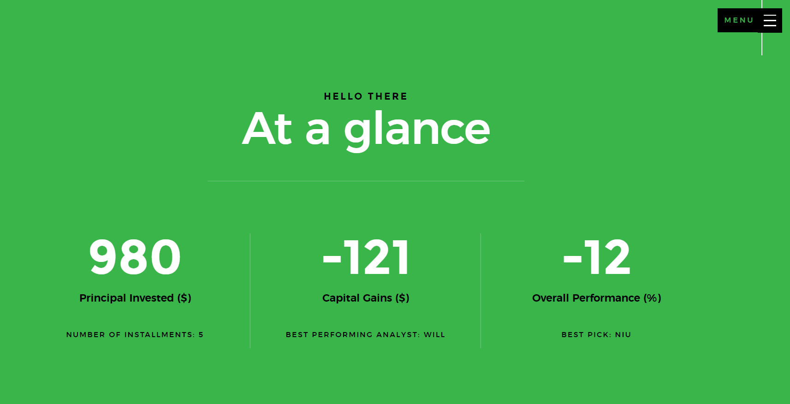

Shiny App for Investing Syndicate
================

This project is an RShiny Web Application I built in order to track the
performance of an Investing Syndicate that I have with some friends.
Every month we contribute $20 each and pitch a company/commodity/option,
and at the end we vote on our favourite pitch and invest the money into
the highest vote.

There were to main reasons I built this app:

-   Track the performance of the syndicate (and create some healthy
    competition)
-   Learn how to build a professional looking application through
    HTMLTemplates

The app is viewable [here](https://andyhcsmith.shinyapps.io/smda/)

Data Collection
---------------

There are two main sources of data that feeds the application:

-   A Google Sheet that contains our monthly picks including information
    on who made the pick, the ticker symbol, the date the pick was made
    and whether or not the pick was chosen by the group. This gets
    manually updated after our monthly meeting.

-   Yahoo Finance to retrieve historical data on our picks. This is
    accessed by calls from R using the `getSymbols` function from the
    `quantmod` library.

Technical Information
---------------------

This web application was written using the R Shiny web framework/R
package. It is a great demonstration on how `HTMLTemplates` can be used
to create professional looking applications using R Shiny. The theme
used was [Glint](https://colorlib.com/wp/template/glint/)

The visualisations (charts) used in this application are from
`echarts4r`, which provide more professional looking graphs than ggplot.

Screenshots
-----------

To-Do List
----------

-   Fix issues
-   Allow user to select ‘change from date selected’ vs ‘absolute
    change’ in plots
-   Clean up ‘Name and Shame’ table
-   Fix bug relating to multiple of same pick by same user
